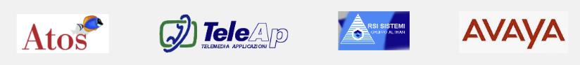
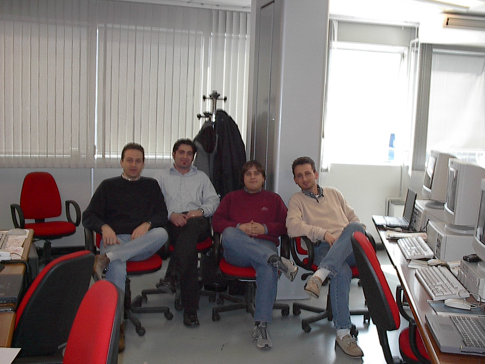
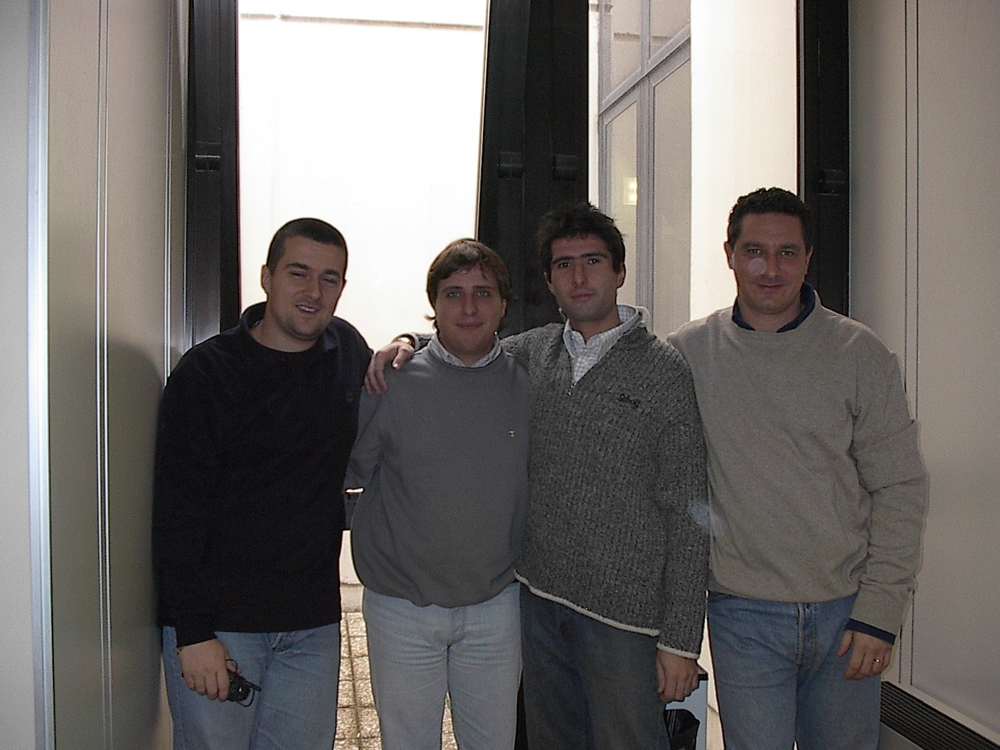
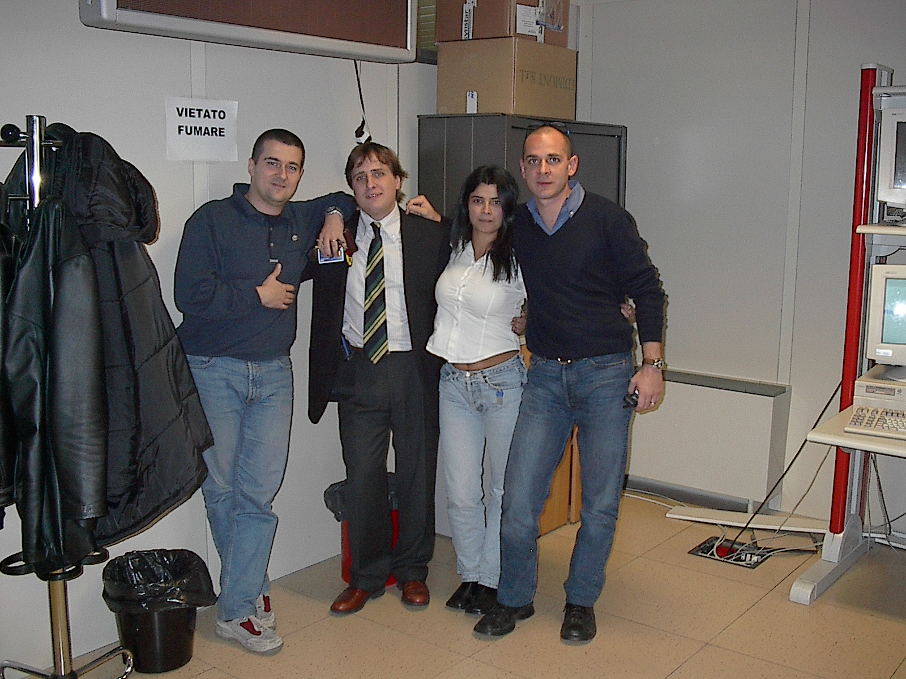

# My Professional Formative Journey (1999–2006)

## Why This Repository

This is a thank you note. To four companies in Rome. To the managers, colleagues, and teammates who invested time in learning and growth. To a time that shaped how I approach problems and work with people—not in the specifics of the technology, which has mostly become obsolete, but in the principles of coordination, responsibility, and care.

The late 1990s and early 2000s were a distinctive moment in enterprise IT: proprietary systems still felt permanent, the internet was just beginning to reshape business, and the work centered on bringing different vendor platforms together to actually function. It was challenging work in ways that modern cloud-native systems aren't—the constraints were tighter, the mistakes more costly, the learning more immediate.

This repository is a walk back through those years. A time capsule, not a resume. It captures the memory of who I worked with, what I learned, and the gratitude for that foundation.

---

## Introduction

This repository chronicles a seven-year professional journey spanning 1999 to 2006 across four companies in Rome, Italy—**Atos**, **TeleAp**, **RSI Sistemi**, and **Avaya**.

The journey represents more than credentials and achievements; it embodies the mentorship, collaboration, and knowledge-sharing that shaped professional growth. To the managers, colleagues, and clients encountered in Rome: your guidance and patience made this foundation possible.

*Professional journey through four Rome-based companies, spanning 1999–2006*

---

### Colleagues and Collaborations

<table>
<tr>
<td width="33%" align="center">

</td>
<td width="33%" align="center">

</td>
<td width="33%" align="center">

</td>
</tr>
</table>

*Exceptional colleagues across four Rome-based companies*

---

## Contents

### [Timeline](TIMELINE.md)

- [Comprehensive Timeline](TIMELINE.md) - 1999 - 2006
  - Chronological documentation of all professional activities, certifications, courses, and milestones with yearly breakdowns and statistics.

### Companies

- [Atos](docs/companies/atos.md) - International systems integration and IT services (May 1999 – September 2000)
- [TeleAp](docs/companies/teleap.md) - Telecommunications and business solutions (September 2000 – April 2003)
- [RSI Sistemi](docs/companies/rsi-sistemi.md) - System integration and enterprise solutions (April – May 2003)
- [Avaya](docs/companies/avaya.md) - Telecommunications and unified communications (June 2003 – August 2006)

### Professional Development & Learning

- [Professional Development (1999-2006)](docs/professional-development/professional-development-1999-2006.md) - Comprehensive overview of certifications, formal training, and learning journey across four companies
  - [Certifications (1999-2006)](docs/professional-development/certifications.md) - Detailed documentation of professional certifications from vendors and standards bodies
  - [Courses and Training (1999-2006)](docs/professional-development/courses.md) - Comprehensive training programs and professional development activities

---

## Assets

The `assets` folder is organized into subdirectories for better organization:

### Images

**Companies** (`assets/images/companies/`)
- Company logos and office photographs
- Team and colleague photos

**Certifications** (`assets/images/certifications/`)
- Certification scans and credential documentation

**Logos** (`assets/images/logos/`)
- Vendor and technology logos from the 1999-2006 era

### Files

**Certifications** (`assets/files/certifications/`)
- Digital copies of professional certifications

**Publications** (`assets/files/publications/`)
- Technical documentation and publications

---

## About This Repository

This collection spans a seven-year journey in Rome (1999-2006) across four companies. Entry-level technical work in systems integration evolved into increasing responsibility in enterprise solutions and telecommunications.

This archive honors the people who made those years valuable: managers who invested time, colleagues who shared knowledge, customers who trusted expertise. It's a tribute to the organizations and teams that made this foundation possible.

---

## The Story Continues

This repository documents the formative years (1999–2006) in Rome, Italy. The professional journey continues beyond 2006 with [My IBM Professional Journey (2006–2012)](https://github.com/nolecram/my_professional_journey_The-IBM-Years-2006-to-2012), spanning three continents—Rome, Dubai, and Melbourne—where the transition from proprietary infrastructure to cloud computing unfolded across six transformative years.

---

*Repository created: November 23, 2025*  
*Professional journey period: 1999-2006 (Rome, Italy)*  
*Purpose: Time capsule and tribute to formative professional years*