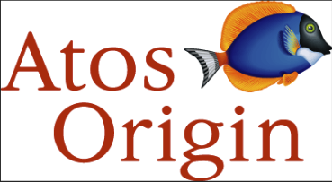
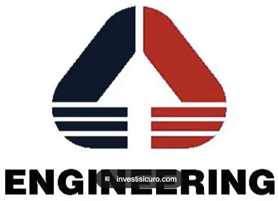

[← Back to README](../../README.md)

# Atos

## Company Overview

**Atos** is an international information technology services and consulting company. Atos Italy was established in the late 1990s as part of the French IT services group Atos, which had been created in 1997 from the merger of Axime and Sligos. In 2000, following the global merger between Atos and the Dutch company Origin B.V., the Italian branch became part of the newly formed **Atos Origin**, a pan-European IT services provider with strong expertise in consulting, systems integration, and outsourcing. Within this new structure, Atos Origin Italy focused on delivering enterprise IT solutions, ERP implementations, infrastructure outsourcing, and digital transformation projects for major Italian clients in banking, telecommunications, manufacturing, and the public sector.

### Company Transformation

| Timeline | Entity | Logo |
|----------|--------|------|
| 1999–2000 (Tenure) | **Atos** |  |
| 2000–2008 | **Atos Origin** |  |
| 2008 onward | **Engineering Ingegneria Informatica** |  |

### Company Profile

- **Industry:** IT Services and Consulting
- **Geographic Presence:** International, pan-European (with significant presence across Europe)
- **Sector Focus:** Enterprise Systems Integration, Consulting, ERP Solutions, Infrastructure Outsourcing
- **Tenure Period:** May 1999 – September 2000
- **Role:** Integration Consultant
- **Location:** Rome, Italy
- **Context:** Entry point into professional IT world, marking the beginning of the seven-year formative journey

---

## Technology Focus

During my time at Atos, the work centered on **Project 119 for Telecom Italia Mobile**—a call center system supporting TIM's emergency and customer service line. The project was the quintessential late-1990s enterprise architecture: Ericsson handled telephony, HP's call center management software managed the computer-telephone integration, Siebel CRM stored customer data, and everything ran on massive, expensive, proprietary hardware—Sun and HP servers, Oracle databases, EMC storage systems. Each vendor component was tightly integrated through custom middleware and careful coordination across teams from Atos, Accenture, and other system integrators.

My role was **Integration Consultant**, responsible for keeping the system stable and ready for production. This meant production and pre-production testing, hardware administration, coordinating across technical teams, and ensuring releases executed smoothly during scheduled maintenance windows (usually nights and weekends).

### Waterfall Cycles and Direct Production Access

The late 1990s operated under a fundamentally different change management paradigm. The project followed strict waterfall methodology: requirements frozen months in advance, development sequenced through defined phases, releases executed as infrequent but monumental events separated by six months or more.

Between releases, teams had direct access to production systems—necessary because there was no infrastructure-as-code, no automated deployments, no CI/CD pipelines. A critical production issue meant immediate hands-on access and intervention. A needed configuration change meant modifying the running system. There were no guardrails or automated rollbacks. The trade-off was stark: incredible responsiveness to crises balanced against significant operational risk.

This hands-on model fostered profound infrastructure understanding. Everyone intimately knew the systems they managed because they owned them directly—no abstraction layers, no managed services. That operational intimacy is what modern DevOps practices, with Infrastructure as Code and observability, aim to recover precisely because we've learned the risks.

### Y2K: Responsibility and the Catastrophe That Never Was

The late 1990s brought genuine anxiety over the "Millennium Bug"—the real risk that decades of two-digit year software ("99" for 1999, "00" for 2000) would cause cascading failures at the century rollover. For Project 119, running systems from the early 1990s with thousands of date-dependent calculations (billing cycles, service dates, contract terms), the stakes felt existential.

Teams spent months auditing code and systems, reviewing every application, verifying hardware date fields, simulating the transition. In December 1999, the team spent December 31st–January 1st monitoring systems in shifts, on standby for potential failures. The infrastructure was scrutinized with unusual intensity.

Nothing happened. The transition was flawless.

The "catastrophe that never was" captures something important about that era: teams were entirely responsible for ensuring their infrastructure would survive specific technical transitions. There was no managed service, no cloud provider with automatic compatibility, no infrastructure abstraction. The responsibility was wholly owned by operations teams, and that responsibility was discharged diligently. The fact that nothing failed was success—a catastrophe prevented through preparation and care.

Y2K preparation was the final major enterprise IT crisis requiring coordinated across-the-board infrastructure review. A decade later, cloud services, managed infrastructure, and abstraction would mean future transitions would largely be handled by external providers. That inflection point—from teams wholly responsible to teams operating abstracted infrastructure—was the bridge from the late 1990s to the modern era.

### On the Obsolescence of This Era

The technology of Project 119 feels almost quaintly outdated now. Ericsson switches gave way to software. Siebel CRM became Salesforce. EMC Symmetrix storage became cloud object stores. SUN 10K servers were replaced by containerized services. The specialized skills required to manage that infrastructure—understanding these specific platforms, vendor certifications, hands-on system administration—became historically interesting rather than operationally essential.

But the principles embedded in managing that complexity? Those have held up. Understanding how systems actually work under pressure. Coordinating across vendor boundaries when no single vendor owns the solution. Executing reliable operations in constrained environments. Building relationships with colleagues and customers. These transcend the specific technologies.

The era ended. The principles lasted.

---

## Professional Learning & Impact

Working on Project 119 meant learning enterprise infrastructure management the hands-on way: managing Unix systems across multiple vendor variants (HP Unix, Solaris, AIX), understanding hardware administration, coordinating releases, and troubleshooting production issues. The learning wasn't theoretical—it was survival learning in an environment where mistakes could bring down a live system.

### Unix Across Multiple Vendors

I had to master Unix across multiple vendor implementations: HP Unix, Solaris (Sun), and AIX (IBM). They were 95% identical in underlying philosophy—process management, file systems, command structure—yet frustratingly different in the details. A shell script that worked on HP Unix would fail on Solaris because a flag worked differently. System administration commands had different syntax. Performance monitoring required different approaches. The lesson: understanding the core principles deeply enough to adapt to each vendor's quirks, a discipline that proved invaluable when technology environments shifted.

The late 1990s data center was Unix territory. Windows NT was emerging, Linux was a hobbyist curiosity, but serious enterprise computing happened on Unix. Within fifteen years, this dominance would be nearly gone—Linux would become dominant, virtualization would abstract hardware, cloud providers would eliminate the need for specialized Unix expertise. The deep knowledge became historically valuable rather than operationally essential.

Yet Unix principles—modularity, small tools doing one thing well, scripting and automation—transcended the specific variants and proved remarkably durable in modern systems engineering.

---

## Team and Organizational Structure

Project 119 involved multiple system integrators (Atos, Pride, Sema), each with distinct vendor relationships, coordinated by Telesoft (Telecom Italia Group). The team worked across TIM offices in Rome—Via Tiburtina and Via di Tor Pagnotta—coordinating across organizational boundaries.

The work was demanding: frequent off-hours efforts during maintenance windows, on-call culture before it was formalized, nights and weekends during deployment cycles executing carefully planned changes. This hands-on experience—coordinating across vendor boundaries, managing waterfall projects, operating production systems directly—taught the realities of enterprise infrastructure management, a paradigm that would be fundamentally disrupted within a decade by continuous delivery and cloud-native practices.

---

## Historical Context

During 1999–2000, Atos was in the early stages of international expansion. The 2000 merger with Dutch company Origin B.V. created Atos Origin, a pan-European IT services provider. In 2008, Atos Origin divested its Italian operations to Engineering Ingegneria Informatica, marking the end of the original Atos presence in Italy within the Atos group.

---

*Atos tenure documentation during formative years professional journey*
