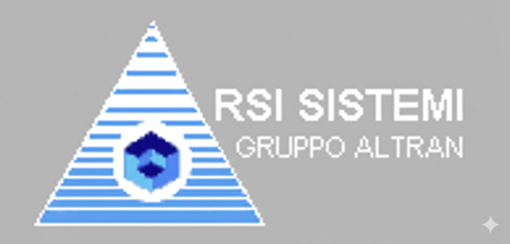

[← Back to README](../../README.md)

# RSI Sistemi

## Company Overview

**RSI Sistemi S.p.A.** was founded in 1976 in Turin, Italy, as a software and IT services company specializing in complex technical solutions for professionals, enterprises, and industrial clients. Over nearly three decades, RSI Sistemi established itself as a key player in Italy's technology sector, with deep expertise in automotive, telecommunications, and defense—the kind of technically demanding domains where engineering rigor and specialized knowledge mattered.

The company's strength lay in understanding complex technical problems and building tailored solutions that integrated multiple vendor platforms and proprietary technologies. Unlike vendor-specific integrators or commodity systems integrators, RSI Sistemi approached technical challenges from an **engineering perspective**: understand the underlying problem, evaluate technology options, select the architecture that solved the customer's actual need.

In 2001, RSI Sistemi was acquired by Altran Group, the French leader in engineering and R&D consulting. This acquisition reflected broader industry consolidation: independent specialists with deep domain expertise were valuable, but scale mattered increasingly. Between 2006 and 2007, RSI Sistemi was merged into Altran Italia. The independent entity that had been RSI Sistemi ceased to exist, absorbed into a larger, more diversified firm.

### Company Transformation

| Timeline | Entity | Logo |
|----------|--------|------|
| 1976–2001 | **RSI Sistemi** |  |
| 2001–2020 (Tenure) | **Altran** |  |
| 2020 onward | **Capgemini Engineering** |  |

### Company Profile

- **Industry:** System Integration, Engineering Services, Enterprise Solutions
- **Founded:** 1976 (in Turin, Italy)
- **Primary Expertise:** Automotive, Telecommunications, Defense, Industrial Systems
- **Geographic Presence:** Italy, with focus on Turin (industrial sector) and Rome (telecommunications)
- **Sector Focus:** Complex technical integration for enterprises and industrial clients
- **Tenure Period:** April – May 2003 (1 month)
- **Role:** Senior Integration Consultant
- **Location:** Rome, Italy (Renault headquarters, Via Tiburtina)
- **Context:** Brief but memorable transition between TeleAp and Avaya; exposure to traditional manufacturing industry

---

## The Brief Engagement: Data Integration and Cross-Industry Learning

The April–May 2003 engagement at RSI Sistemi was short—just one month—but it served a specific purpose. RSI Sistemi had been contracted by Renault to perform a significant data integration project: migrating and synchronizing customer records between Renault and Nissan databases as part of the companies' growing alliance and operational integration.

The project needed someone with specific expertise: hands-on experience managing large volumes of customer data, understanding ETL (Extract-Transform-Load) processes, and having worked with Siebel CRM at scale. The Project 119 background—years of dealing with massive customer record sets at Telecom Italia Mobile, integrating Siebel with operational systems, managing data quality and transformation at production scale—was exactly the fit RSI Sistemi needed.

The role was straightforward: lead the data migration and integration work, ensure data quality throughout the process, coordinate between the two automotive companies' systems, and deliver a customer database that both Renault and Nissan could trust operationally. Work was based regularly at Renault's headquarters in Rome (Via Tiburtina, ironically the same area where Project 119 had been headquartered years earlier).

---

## Cross-Industry Perspective: Automotive Industry and Technology

For someone who had spent the previous three years in telecommunications and IT services consulting, the automotive industry exposure was eye-opening. The contrast was stark and instructive.

Telecom Italia and the telecommunications sector generally were technology-native environments. Systems changed rapidly. Technology vendors dominated the relationship. Projects were structured around technology architectures. The pace of innovation was relentless. Y2K, the dot-com boom and bust, the shift from proprietary to IP-based systems—technology itself was the primary story.

Renault, and traditional automotive manufacturing generally, operated in a fundamentally different context. The business had been stable for decades. Production processes changed slowly and deliberately. Technology was important, but it was *infrastructure for the business*, not the business itself. Decision-making was more conservative and longer-term. The automotive industry ran on deeply embedded legacy systems: IBM AS/400 minicomputers managing inventory and production data, SCADA (Supervisory Control and Data Acquisition) systems controlling factory floor operations, mainframe systems for financial and supply chain operations. These systems had been running for decades, had been customized extensively, and were tightly woven into operational processes. Vendor relationships lasted for years or decades, changes were planned conservatively, and the organizational culture was established and formal.

This wasn't better or worse than technology-driven environments; it was simply different. Where the telecom and IT services world prided itself on agility and rapid iteration, the automotive industry valued stability, proven solutions, and long-term relationships. Where telecom viewed technology as constantly evolving, automotive saw technology as a solved problem that needed to be managed reliably rather than constantly reinvented.

The experience provided valuable perspective: technology integration challenges looked different depending on the industry's baseline assumptions about change and risk. Renault's careful, methodical approach to a data integration project that a telecom company would have executed with more urgency was a reminder that **industry culture shapes how technical work gets done**.

---

## The Work: Data Integration and Customer Records

The Renault-Nissan customer database integration itself was straightforward technically but significant organizationally. The task was to:

- Extract customer records from Renault's systems (various legacy databases and the Siebel CRM system)
- Transform the data to a common format that both companies could use
- Load it into a unified database accessible to both Renault and Nissan
- Ensure data quality (no duplicates, consistent formatting, valid fields)
- Validate that the integrated database matched the source data

This was the same type of work that had been done on Project 119 (managing millions of customer records, ensuring data integrity, integrating systems), but in a different context and with different stakes. A failed Telecom Italia Mobile customer database was a production crisis. A failed Renault-Nissan integration was a strategic concern—these companies were attempting to share customer information and coordinate operations, and the data integration had to work flawlessly.

The project executed successfully. The customer database was migrated, validated, and operational. The work was completed in the month-long engagement, and the delivery was solid. There was satisfaction in the successful technical execution and in the explicit gratitude from both Renault and RSI Sistemi teams.

---

## Professional Learning & Context

## Professional Learning & Context

The RSI Sistemi engagement, though brief, reinforced important lessons about domain expertise, industry culture, and strategic career decisions:

**Domain expertise transcends industry boundaries.** The skills developed managing Project 119's customer data applied directly to Renault's challenge. ETL processes, data quality discipline, vendor integration coordination—these were universal patterns.

**Industry culture shapes technical work.** The automotive industry's reliance on aging IBM AS/400 and SCADA systems reflected deep organizational roots—pragmatic decisions made in different contexts that accumulated into substantial technical debt. Today those systems have largely been retired; at the time, they were simply how manufacturing operated. This reinforced that technology serves organizational and business context, not the reverse.

**Strategic career clarity.** The telecom and IT services sector had been the center of gravity for the previous three years. The automotive industry pace, while valuable for perspective, reinforced that telecom and technology was where the most interesting work was happening—in the midst of genuine transformation (post-bubble consolidation, shift from circuit-switched to IP-based infrastructure, evolution of enterprise software). Manufacturing was stable and mature. The learning was valuable, but the pull back toward telecommunications was strong.

---

## The Transition to Avaya

The brief RSI Sistemi engagement ended in May 2003, and by June 2003, an opportunity came from Avaya: a role working on Telecom Italia projects, which meant returning to a familiar customer (TIM), a familiar domain (telecommunications), and a stable, large-scale organization (Avaya). It was less entrepreneurial than the integrator world of TeleAp or the engineering specialty of RSI Sistemi, but it offered security, scale, and deep technical depth in telecommunications that seemed attractive after three years of volatile change in the Italian IT services sector.

The decision to move to Avaya was deliberate: recognition that the telecommunications infrastructure domain was where the most substantial, long-term work was happening; understanding that in a post-bubble, consolidating market, working for a stable, large-scale vendor offered better career prospects than independent integrators; and appreciation for the specific opportunity to work on Telecom Italia operations, understanding the customer deeply, and helping navigate the infrastructure transition that was unfolding.

The month at RSI Sistemi was brief but genuinely valuable—exposure to a different industry, confirmation of domain expertise transferability, and clarification about where the most interesting work would unfold over the following years.

---

## Historical Context

RSI Sistemi's acquisition by Altran in 2001 and subsequent integration into Altran Italia by 2007 reflected broader European IT services consolidation. The late 1990s had seen numerous independent specialists with deep domain expertise. By the early 2000s, consolidation accelerated as enterprises wanted integrated service providers handling end-to-end solutions. Single-domain specialists, however technically excellent, struggled against larger, more diversified firms.

The market consolidated into a few large national players (Value Team, Engineering, Altran Italia) and international firms (Accenture, IBM). Independent specialists had limited future unless they could scale rapidly or be acquired. RSI Sistemi chose acquisition, which preserved expertise but absorbed the company into a larger organization with different priorities.

This pattern continued: Altran was acquired by Capgemini in 2020 and rebranded as Capgemini Engineering in 2021. The trajectory from independent specialist (RSI Sistemi 1976–2001) through acquisition (Altran 2001–2020) through integration into a global giant (Capgemini 2020 onward) captured the arc of European IT services consolidation across 40 years.

---

*RSI Sistemi tenure documentation during formative years professional journey*
