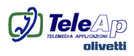
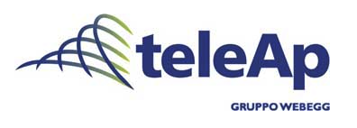
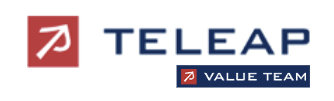
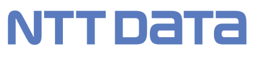

[← Back to README](../../README.md)

# TeleAp

## Company Overview

**TeleAp** (Telemedia Applicazioni S.p.A.) was founded in 1995 as the Olivetti Group's specialist in Customer Relationship Management and Contact Center solutions. The company developed proprietary telephony tools and built deep expertise in Siebel CRM while integrating technologies from strategic partners such as Ericsson, Cisco, and Genesys. This focus on specialized telecom and CRM solutions positioned TeleAp as a niche but technically sophisticated player in Italy's enterprise IT landscape.

The company's trajectory reflected broader consolidation in the Italian IT services sector. In 2001, TeleAp was incorporated into Webegg, Olivetti's consulting and systems integration arm, where it expanded its role beyond pure product development into full-scale digital transformation projects. By 2004, TeleAp was merged into Value Team, the IT consulting and solutions company created by Value Partners through the consolidation of Webegg and other technology firms. Within Value Team, TeleAp continued to grow, becoming part of one of Italy's leading system integrators. The consolidation trend continued: in 2011, Value Team was acquired by NTT DATA, completing TeleAp's transformation from a niche Olivetti subsidiary into part of a global IT services powerhouse.

### Company Transformation

| Timeline | Entity | Logo |
|----------|--------|------|
| 1995–2001 | **TeleAp (Olivetti)** |  |
| 2001–2004 (Tenure) | **Webegg (Olivetti)** |  |
| 2004–2011 | **Value Team** |  |
| 2011 onward | **NTT DATA** |  |

### Company Profile

- **Industry:** Customer Relationship Management (CRM), Contact Center Solutions, IT Consulting & Systems Integration
- **Founding:** 1995 (as TeleAp)
- **Parent Organization:** Olivetti Group (1995–2001), Webegg/Olivetti (2001–2004), Value Team/Value Partners (2004–2011), NTT DATA (2011 onward)
- **Geographic Presence:** Italy, with growing national reach through Value Team integration
- **Sector Focus:** Siebel CRM implementations, Contact Center solutions, Digital Transformation, Telecom integration
- **Tenure Period:** September 2000 – April 2003 (2 years, 7 months)
- **Role:** CRM Solutions Consultant / Systems Integration Specialist
- **Location:** Rome, Italy
- **Context:** Transition from infrastructure-focused work at Atos to CRM and customer-facing solutions at TeleAp

---

## The Transition from Atos to TeleAp

The move to TeleAp in September 2000 marked a shift in focus rather than a departure. Olivetti had acquired Telecom Italia (TIM), and Project 119 underwent architectural reorganization: Ericsson retained the telephony platform, but CTI responsibility shifted to Genesys, and Siebel CRM integration moved to TeleAp.

TeleAp needed someone with deep knowledge of Project 119's architecture. The challenge was transitioning an operational production system from one vendor architecture to another without interruption. The role was Senior Integration Consultant with a mandate to guide the technical transition and eventually help commercialize the expertise beyond Project 119.

The shift was from managing infrastructure (Atos) to leading solutions-oriented integration (TeleAp).

---

## Technology Focus

Project 119 at TeleAp required executing a complex architectural transition: migrating from HP CCM to Genesys for CTI while integrating Siebel CRM as a real-time customer information system. Unlike the infrastructure management focus at Atos, the mandate was solution-oriented: deliver business value through CRM integration.

The technical challenge was significant: managing the transition without disrupting a system handling millions of customer interactions, integrating three major platforms (Ericsson, Genesys, Siebel) that weren't designed for seamless interoperability, and ensuring agents had customer information instantly at call time.

### Siebel Integration and Multi-Vendor Coordination

The core challenge was real-time Siebel CRM integration with telephony: agents needed instant customer information at call time, with call outcomes flowing back into the CRM. This required seamless coordination between Ericsson, Genesys, and Siebel—platforms not designed to work together.

As a production system, there was no margin for error. The transition from HP CCM to Genesys had to happen without downtime. The lesson was clear: large-scale transitions in production environments succeed through organizational coordination as much as technical architecture. Getting vendors to cooperate, ensuring organizational alignment, and managing knowledge transfer across teams proved as critical as the technical design.

The knowledge gained—multi-vendor integration patterns, real-time CRM integration, large-scale transition management—became transferable. As TeleAp expanded beyond Project 119, these patterns scaled to other customers, industries, and CRM challenges. The role evolved from managing a single complex project to leading a broader CRM solutions practice as a Program Manager.

## Professional Learning & Impact

The fundamental lesson from TeleAp was that technical excellence is necessary but insufficient for large-scale technology implementations. Project 119's transition succeeded through disciplined vendor coordination, clear ownership, and organizational alignment—not just correct technical architecture.

As the role evolved from Senior Integration Consultant to Program Manager, the focus shifted from executing a single complex project to scaling expertise across multiple customers and industries. This required different skills: applying patterns from one context to others, mentoring consultants, building repeatable methodologies.

The knowledge of a single large project, when captured properly, could become the foundation for broader practice. The Siebel integration patterns, multi-vendor coordination approaches, and transition management discipline applied across industries and customer contexts.

### Integration Architecture in the Pre-Cloud Era

Incompatible systems required careful architecture, custom middleware, and detailed coordination. Integration quality determined whether systems worked or failed under load. This architectural thinking—understanding system interactions, failure points, and friction at boundaries—became foundational. Modern cloud-native systems and APIs changed the mechanics, but the principle remained: good integration requires understanding what each system does well and where boundaries create friction.

## On the Obsolescence of This Era

Siebel CRM, Genesys CTI, Ericsson NASP, and the custom middleware of 2000–2003 feel almost archaeological now. Siebel is essentially a legacy system within Salesforce. Heavy customization has been replaced by configuration-driven platforms. On-premise infrastructure has moved to cloud. Specialized contact center expertise has dissolved as cloud platforms (Five9, Amazon Connect, Genesys Cloud) now handle what once required deep expertise.

Yet the principles transcended the platforms: understanding customer processes, discipline in implementation, integration architecture that anticipates failure, and the ability to scale knowledge from a single project to broader practice. The specific technologies became obsolete. The principles lasted.

---

## Project 119's Evolution

Project 119 exemplified the transition era: it began as a pure CTI infrastructure project (Atos era), underwent architectural reorganization to integrate Siebel CRM (TeleAp era), and eventually became a case study in integrating modern CRM systems with traditional telecom infrastructure. That evolution—from specialized components to integrated platforms, from on-premise to cloud, from custom integration to plug-and-play APIs—mirrored the broader evolution of enterprise IT. The journey through that transition taught more than theory could.

---

## Team and Culture

TeleAp operated differently from Atos. Where Atos was infrastructure-focused and operationally driven, TeleAp was solutions-oriented. Business analysts worked alongside technical architects. Project managers managed organizational change as much as technical delivery—helping clients transition to new processes enabled by CRM and integration.

The consolidations during tenure (TeleAp into Webegg, then Value Team) reflected broader industry consolidation: smaller specialized firms merging into larger system integrators. The advantage was scale and broader services. The trade-off was diluted specialization: a pure CRM specialist became one division within a diversified IT services company.

---

## Historical Context

TeleAp's trajectory from Olivetti subsidiary through Webegg to Value Team to NTT DATA reflected broader European IT services consolidation. By the early 2010s, Italian IT services had consolidated into a handful of large players. Specialized niches became less viable as standalone entities. TeleAp's experience was absorption into larger organizations while technical expertise and customer relationships continued to drive value.

---

*TeleAp tenure documentation during formative years professional journey*
