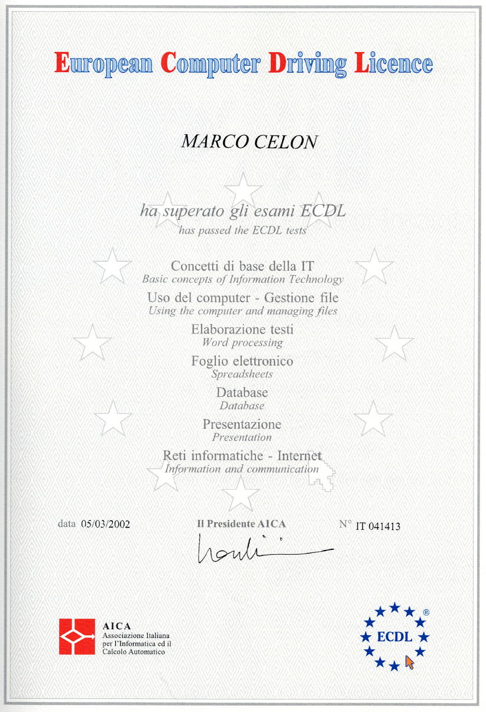
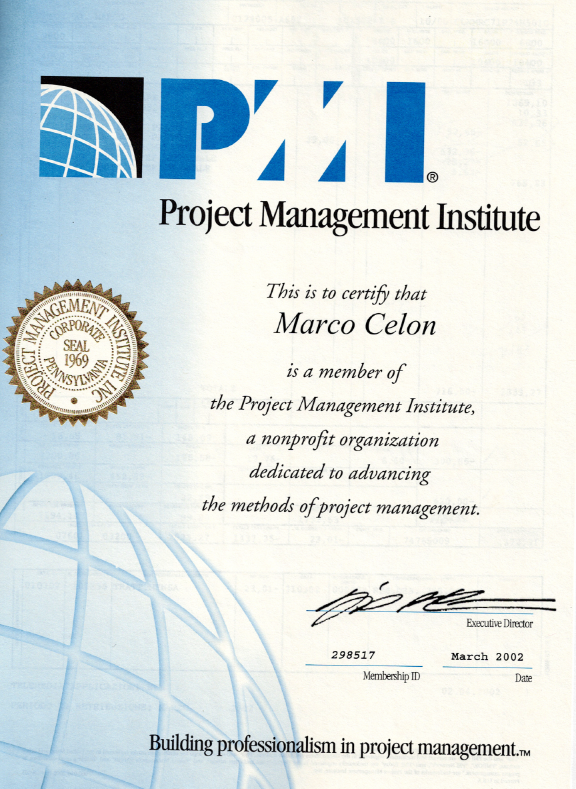
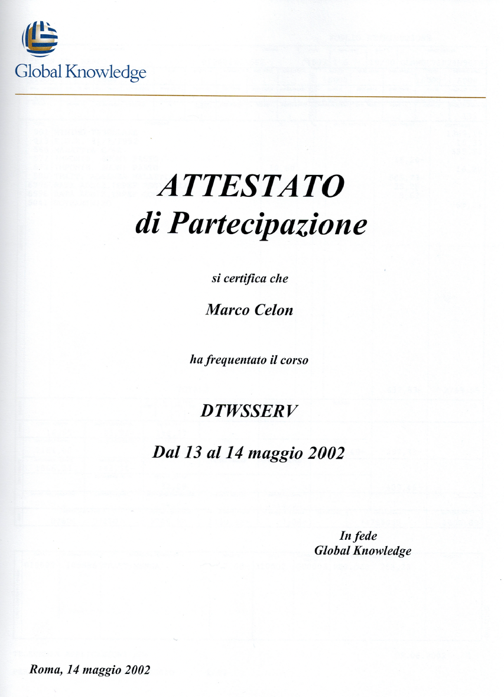
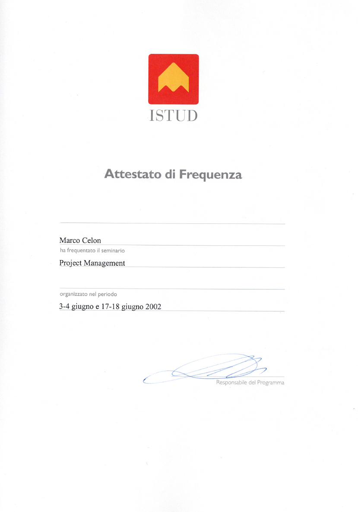
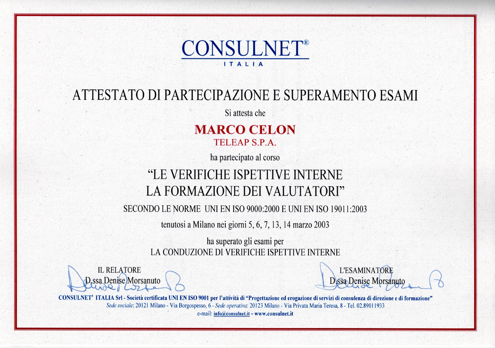
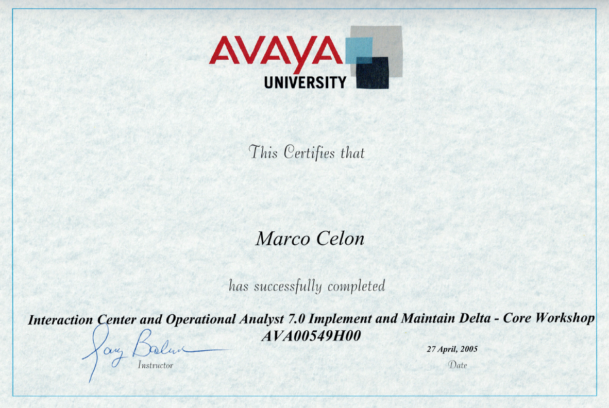
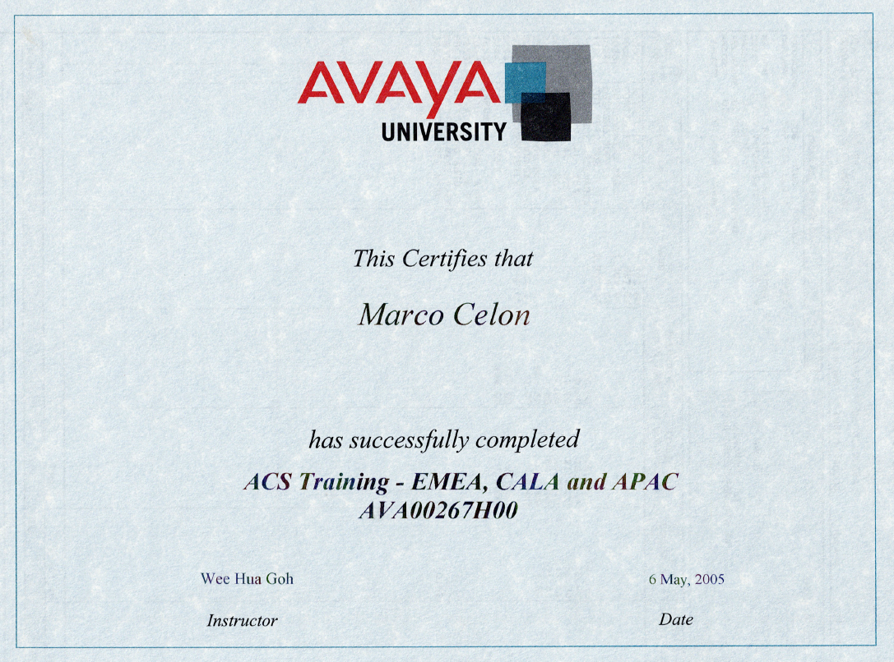

[← Back to README](../../README.md)

# Professional Development and Learning (1999-2006)

This documentation captures the professional certifications, formal courses, and vendor training completed during the formative years (1999-2006) across four companies in Rome, Italy. These credentials represent a snapshot of enterprise IT, telecommunications, and system integration priorities during the late 1990s and early 2000s. As technology evolved dramatically over the past two decades, these certifications and courses serve as historical documentation of the learning landscape and standards that defined that era rather than current technical relevance.

---

## Certifications and Formal Training

### Microsoft Office User Specialist – Word 2000

*Microsoft Office User Specialist – Word 2000 | Certified by Microsoft Corporation*

**Organization:** Microsoft  
**Certification:** Microsoft Office User Specialist (MOUS)  
**Specialty:** Microsoft Word 2000  
**Participant:** Marco Celon  
**Certified by:** Anne Marie McSweeney, Director of Microsoft Certification and Skills Assessment  
**Context:** Office productivity certification during late 1990s era of IT systems integration

**Significance:** The MOUS Word 2000 certification represents foundational office productivity skills during the era when Microsoft Office was standardizing across enterprises. While seemingly basic by modern standards, office automation and document management were essential capabilities in systems integration work, particularly when coordinating across teams and documenting complex technical processes. This certification documented competency in tools that, while now commonplace, were still being formalized and standardized during the late 1990s.

---

### ECDL – European Computer Driving Licence (May 2002)

*ECDL – European Computer Driving Licence | AICA (Associazione Italiana per l'Informatica e il Calcolo Automatico)*

**Organization:** AICA (Associazione Italiana per l'Informatica e il Calcolo Automatico)  
**Certification:** ECDL – European Computer Driving Licence  
**Participant:** Marco Celon  
**Date:** May 3, 2002  
**Certificate Number:** IT 041413  
**Modules Completed:**
- Basic IT concepts and information technology fundamentals
- Computer use and file management
- Word processing
- Spreadsheets and data analysis
- Databases
- Presentations
- Information and communication (networks and internet)

**Significance:** The ECDL was a comprehensive foundational IT literacy certification, representing mastery of fundamental computer skills across multiple domains. Completed in May 2002 during the TeleAp tenure, this certification documented broad IT competency across office productivity, data management, and communications—skills that complemented the specialized technical expertise being developed on Project 119. The ECDL's breadth (covering seven different competency areas) represented the "literacy" required to operate effectively in IT environments of that era, distinct from specialized domain expertise but equally essential for professional communication and coordination across non-technical and technical teams.

---

### PMI Membership (March 2002)

*Project Management Institute Membership | Professional Membership – March 2002*

**Organization:** Project Management Institute (PMI)  
**Membership Type:** Professional Member  
**Participant:** Marco Celon  
**Date:** March 2002  
**Membership ID:** 298517  
**Organization Focus:** "Building professionalism in project management"

**Significance:** PMI membership in March 2002 represented professional commitment to project management discipline and methodologies. This was significant during the TeleAp tenure, when the role was evolving from Senior Integration Consultant focused on Project 119 to broader Program Manager responsibilities. PMI membership signaled alignment with formal project management frameworks (PMBOK – Project Management Body of Knowledge) and indicated participation in the growing professionalization of project management as a distinct discipline. During the late 1990s and early 2000s, formal project management methodologies were becoming standard practice in enterprise IT—PMI membership represented commitment to these practices and engagement with a professional community dedicated to advancing project management excellence.

---

### Global Knowledge – DTWSSERV Course (May 2002)

*Global Knowledge DTWSSERV Course | Distributed Technologies and Web Services – May 13-14, 2002*

**Organization:** Global Knowledge  
**Course:** DTWSSERV (Distributed Time and Work Service / Distributed Technologies and Web Services)  
**Participant:** Marco Celon  
**Dates:** May 13–14, 2002  
**Location:** Rome  
**Context:** Professional training in emerging distributed systems and web services technologies

**Significance:** The DTWSSERV course (May 2002) represented early exposure to distributed systems and web services—emerging technologies that were beginning to reshape enterprise IT architecture. While Project 119 was still based on tightly coupled, on-premise proprietary systems, this training indicated awareness of the technological transition underway: from monolithic, location-dependent systems toward distributed architectures and web-based services. This was prescient training during the TeleAp era—the same period when the internet was beginning to reshape telecommunications and enterprise IT was contemplating post-dot-com bubble recovery and technological evolution. The course documentation distributed technologies and web services training before these concepts became mainstream, capturing an early moment in the shift from traditional infrastructure to internet-native architectures.

---

### ISTUD – Project Management Seminar (June 2002)

*ISTUD Project Management Seminar | June 3-4 and June 17-18, 2002 | Rome*

**Organization:** ISTUD (Italian business school / management development organization)  
**Program:** Project Management seminar  
**Participant:** Marco Celon  
**Dates:** June 3–4 and June 17–18, 2002  
**Location:** Rome  
**Certificate Date:** May 14, 2002  
**Type:** Professional development seminar in project management methodologies

**Significance:** The ISTUD Project Management seminar (June 2002) provided structured business-focused training in project management—complementing the PMI membership commitment with practical seminar education. ISTUD is a respected Italian business school specializing in management development and professional training. This two-part seminar (spanning two weekends in June) provided intensive training in project management methodologies and practices from a business-oriented perspective. During the TeleAp tenure, as the role was evolving toward Program Manager responsibilities managing broader CRM consulting practice rather than single-project focus, this seminar provided formal education in project management frameworks and business practices—reinforcing the professional transition from technical specialist to business-focused project leadership.

---

### Consulnet Italia – Internal Quality Verification Training (March 2003)

*Consulnet Italia – Attestato di Partecipazione e Superamento Esami | Internal Quality Verification Evaluator Training – March 2003*

**Organization:** Consulnet Italia  
**Course:** "Le Verifiche Ispettive Interne – La Formazione dei Valutatori" (Internal Quality Verification – Evaluator Training)  
**Participant:** Marco Celon, TeleAp S.P.A.  
**Dates:** March 5, 6, 7, 13, 14, 2003 (Milan)  
**Standards:** UNI EN ISO 9000:2000 and UNI EN ISO 19011:2003  
**Achievement:** Passed internal verification inspection examination  
**Instructor:** D.ssa Denise Morsanuto  
**Context:** Quality management system training and internal audit evaluator certification

**Significance:** The Consulnet Italia Internal Quality Verification training (March 2003) represented formalized expertise in quality management systems and internal auditing—skills that became increasingly important as TeleAp transitioned toward broader consulting practice beyond Project 119. The training covered ISO 9000 and ISO 19011 standards, certifying competency in conducting internal quality audits and evaluations. During the final months at TeleAp (before transition to RSI and Avaya), this training documented commitment to quality management frameworks and positioned for broader consulting responsibilities. The fact that this training occurred in March 2003—coinciding with the transition period from TeleAp to RSI Sistemi to Avaya—captured the professionalization of quality and process discipline during a period of significant organizational change.

---

### Avaya University – ACS Training EMEA, CALA and APAC (May 2005)

*Avaya University ACS Training - EMEA, CALA and APAC | Advanced Communication Solutions – May 6, 2005*

**Organization:** Avaya University  
**Course:** ACS Training - EMEA, CALA and APAC (Advanced Communication Solutions)  
**Course Code:** AVA00267H00  
**Participant:** Marco Celon  
**Date:** May 6, 2005  
**Instructor:** Wee Hua Goh  
**Geographic Coverage:** Europe, Middle East & Africa (EMEA), Central America, Latin America & Caribbean (CALA), Asia-Pacific (APAC)  
**Context:** Global Avaya communication solutions training during mid-tenure at Avaya

**Significance:** The Avaya ACS Training (May 2005) documented expertise in Advanced Communication Solutions across Avaya's primary global regions. By May 2005, nearly two years into the Avaya tenure, this training represented deepened vendor platform expertise. ACS (Advanced Communication Solutions) encompassed Avaya's portfolio of telecommunications and unified communications platforms—the core of Avaya's product strategy during the early-to-mid 2000s. The fact that the training covered EMEA, CALA, and APAC regions indicated preparation for broader regional support and global telecommunications infrastructure understanding. This training occurred during a period when telecommunications was beginning the transition toward IP-based communications and unified messaging, and Avaya was positioning itself as a global provider of these next-generation platforms.

---

### Avaya University – Interaction Center and Operational Analyst 7.0 (April 2005)

*Avaya University Interaction Center and Operational Analyst 7.0 Implement and Maintain Delta - Core Workshop | April 27, 2005*

**Organization:** Avaya University  
**Course:** Interaction Center and Operational Analyst 7.0 Implement and Maintain Delta - Core Workshop  
**Course Code:** AVA00549H00  
**Participant:** Marco Celon  
**Date:** April 27, 2005  
**Instructor:** Jay Balim  
**Platform:** Avaya Interaction Center 7.0 (Delta version)  
**Context:** Contact center platform implementation and operational analysis training

**Significance:** The Avaya Interaction Center (IC) 7.0 training (April 2005) documented specialized expertise in Avaya's contact center platform—one of the company's flagship products. Interaction Center was Avaya's solution for customer contact management and employee engagement, representing the evolution of telephony and CTI (computer-telephone integration) platforms from earlier proprietary systems toward more integrated, IP-based contact center architectures. The "Implement and Maintain Delta" designation indicated training in the specific version (Delta) deployed in production environments, positioning for hands-on implementation and operational responsibility. By April 2005, approximately two years into the Avaya tenure, this training completed the technical foundation for deep expertise in Avaya's core contact center solutions—the natural evolution from Project 119 CTI/Siebel integration work at TeleAp toward Avaya's modern contact center platform. The training as an Operational Analyst indicated role responsibilities extending beyond pure implementation into ongoing operational analysis and optimization of contact center performance.

---

### Siebel Core Consultant Course (July 2001)

*Siebel University Core Consultant Course – July 9–27, 2001 | TeleAp S.P.A.*

**Organization:** Siebel University  
**Course:** Core Consultant Course  
**Participant:** Marco Celon, TeleAp S.P.A.  
**Duration:** July 9–27, 2001 (3 weeks)  
**Context:** Formal vendor training in Siebel CRM during the critical Project 119 transition period at TeleAp

**Significance:** This certification documents formal expertise in Siebel CRM at the moment when TeleAp was transitioning Project 119 to a real-time Siebel integration architecture. The Core Consultant certification represented deep technical knowledge of Siebel's object model, customization framework, and integration patterns—essential for managing a complex production system serving millions of customer interactions at Telecom Italia Mobile. The three-week intensive course provided structured training in what had previously been learned through hands-on project work at Atos, formalizing expertise that would become transferable across multiple customer implementations as TeleAp scaled its CRM consulting practice.

---

## Professional Learning Overview

### 1999-2000: Foundation (Atos)

**Focus:** Infrastructure fundamentals, Unix system administration, multi-vendor coordination

- **Project 119 immersion** - Hands-on learning managing proprietary enterprise infrastructure: Ericsson telephony, HP call center management, Siebel CRM, Oracle databases, EMC storage
- **Unix variants expertise** - Deep learning across HP Unix, Solaris, and AIX; understanding Unix philosophy while adapting to vendor-specific differences
- **Production operations** - Direct access to production systems, on-call infrastructure management, waterfall release coordination
- **Y2K preparation** - Extensive infrastructure audits, system validation, production monitoring across year-2000 transition
- **Multi-vendor coordination** - Working across Atos, Pride, Sema, Accenture to coordinate infrastructure management for a complex integrated system

**Technologies Studied:** Ericsson NASP, HP CCM, Siebel, Oracle, EMC, Sun, HP Unix systems

---

### 2001-2003: Specialization (TeleAp)

**Focus:** CRM systems, enterprise integration, large-scale production transitions

- **Siebel Core Consultant Course** (July 2001) - Formal three-week certification in Siebel CRM platform, object model, customization framework, integration patterns
- **Project 119 architectural transition** - Leading technical transition from HP CCM to Genesys CTI while integrating Siebel CRM for real-time customer information delivery
- **Multi-vendor integration patterns** - Deep learning in coordinating three major vendor platforms (Ericsson, Genesys, Siebel) designed independently; understanding integration architecture, data flows, failure points
- **Contact center solutions** - Expertise in contact center infrastructure, CTI (computer-telephone integration), real-time agent screen population, call outcome tracking
- **Solutions scaling** - Transitioning from Project 119 specialist to broader CRM consulting practice; applying patterns from single complex project to multiple customer contexts
- **Organizational change management** - Managing large-scale production transitions without downtime; coordinating across vendor boundaries; knowledge transfer and methodologies documentation

**Technologies Studied:** Genesys CTI, Siebel CRM (deeper expertise), Ericsson NASP, contact center architecture, ETL processes

---

### 2003: Cross-Industry Perspective (RSI Sistemi)

**Focus:** Data integration, industry culture differences, domain expertise transfer

- **Data integration project** - Leading Renault-Nissan customer database migration and synchronization; hands-on ETL expertise
- **Automotive industry immersion** - Brief but significant exposure to manufacturing industry context; understanding legacy systems (IBM AS/400, SCADA); learning how industry culture shapes technical decision-making
- **Domain expertise portability** - Confirmation that skills from telecommunications transfer directly to other industries; ETL and data quality principles are universal

**Technologies Studied:** Renault and Nissan legacy systems, Siebel CRM (applied), IBM AS/400, SCADA systems, data quality and ETL processes

---

### 2003-2006: Vendor Specialization (Avaya)

**Focus:** Telecommunications, unified communications, Avaya platforms and products

- **Avaya University training** (2005) - Formal vendor training in Avaya communication solutions and contact center platforms
  - ACS Training - EMEA, CALA and APAC (May 2005): Advanced Communication Solutions across global regions
  - Interaction Center and Operational Analyst 7.0 (April 2005): Contact center platform implementation and operational analysis
- **Avaya infrastructure** - Specialized learning in Avaya telecommunications solutions, PBX systems, unified communications, contact center platforms
- **Telecom Italia expertise deepening** - Returning to familiar customer (TIM) with deeper understanding of telecom infrastructure after exposure to manufacturing and non-telecom sectors
- **Telecommunications evolution** - Witnessing shift from traditional telecom infrastructure toward IP-based communications; understanding convergence of voice and data
- **Large-scale vendor specialization** - Gaining deep expertise in Avaya product ecosystem while understanding broader telecommunications industry dynamics
- **Contact center platform specialization** - Advancing from Siebel/Genesys integration patterns (TeleAp) to deep expertise in Avaya's Interaction Center platform

**Technologies Studied:** Avaya telecom platforms, Avaya Interaction Center (contact center), unified communications, IP telephony, contact center systems, Telecom Italia infrastructure evolution

---

## Learning Arc Summary

The professional development journey (1999-2006) followed a clear progression:

1. **Foundation** (Atos, 1999-2000): Learning infrastructure fundamentals, multi-vendor coordination, production operations
2. **Specialization** (TeleAp, 2001-2003): Deepening expertise in CRM systems and integration; formal Siebel certification; scaling knowledge from single project to broader practice
3. **Cross-pollination** (RSI, 2003): Understanding domain expertise portability across industries; learning how industry context shapes technical work
4. **Vendor depth** (Avaya, 2003-2006): Specialized expertise in telecommunications and unified communications; working for a major platform vendor rather than system integrators

**Constant themes across all four companies:**
- Hands-on learning through production system ownership
- Multi-vendor coordination and integration architecture
- Knowledge transfer and scaling expertise
- Understanding technology as infrastructure serving business needs
- Gratitude for mentors and organizations that invested in continuous growth

---

## Obsolescence and Historical Value

The technologies covered in this learning journey—Siebel CRM, Genesys CTI, Ericsson NASP, Avaya proprietary telephony systems, IBM AS/400, SCADA systems—have been largely superseded or fundamentally transformed over the past two decades:

- **Siebel CRM** became a legacy system within Salesforce; cloud-based CRM platforms have replaced on-premise deployments
- **Genesys CTI** evolved into cloud-native contact center platforms; the specialized CTI expertise is now largely abstracted
- **Ericsson NASP** and proprietary telephony systems gave way to IP-based, software-defined communications
- **IBM AS/400** and SCADA systems have been retired in most organizations, replaced by modern data platforms and industrial IoT

Yet the learning transcends the specific technologies:

- **Infrastructure intimacy** - Understanding how systems work under pressure and at scale remains relevant regardless of platform
- **Integration patterns** - Learning to coordinate across vendor boundaries and manage system interactions applies whether coordinating Ericsson, Genesys, and Siebel or modern cloud microservices
- **Production operations discipline** - Responsibility for system stability and operational excellence defined that era and remains foundational in modern DevOps
- **Domain expertise** - Understanding customer processes, industry context, and how technology serves business needs proved transferable across telecommunications, automotive, and specialized domains
- **Knowledge scaling** - The ability to capture learning from a single complex project and apply patterns to broader contexts became increasingly valuable as career progressed

---

*Professional development documentation during formative years (1999-2006) in Rome, Italy*
